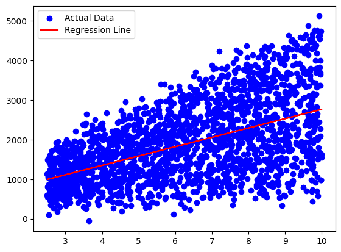

# Vanilla Linear Regression: Coffee Shop Revenue Prediction

A from-scratch implementation of Simple (Univariate) Linear Regression in Python. This project demonstrates the mathematical foundation of gradient descent by predicting coffee shop revenue based on a single continuous feature, without relying on high-level machine learning libraries.

## 📌 Project Overview
The goal of this project is to build a regression model purely using `NumPy`. By implementing the optimization algorithms manually, we gain a deeper understanding of feature scaling, weight updates, and cost minimization.

## 📊 Dataset Description
The model is trained on a dataset tracking coffee shop performance:
* **Target Variable ($y$):** `Revenue` (Continuous)
* **Feature Variable ($x$):** Extracted primary feature (e.g., Foot Traffic)

## 🧠 Core Concepts Implemented

### 1. Feature Normalization
To ensure efficient convergence during gradient descent, the input feature is standardized using Z-score normalization:
$$x_{norm} = \frac{x - \mu}{\sigma}$$

### 2. Hypothesis Function
The model predicts revenue using the linear equation:
$$h_\theta(x) = wx + b$$

### 3. Cost Function (Mean Squared Error)
To measure accuracy, the model calculates the MSE:
$$J(w, b) = \frac{1}{2m} \sum_{i=1}^{m} (h_\theta(x^{(i)}) - y^{(i)})^2$$

### 4. Gradient Descent
The weight ($w$) and bias ($b$) are updated iteratively (with a learning rate of $\alpha = 0.004$) to reach the global minimum of the cost function:
$$w := w - \alpha \frac{1}{m} \sum_{i=1}^{m} (h_\theta(x^{(i)}) - y^{(i)}) x^{(i)}$$

## 📈 Visualization
The script uses `matplotlib` to output a scatter plot of the actual dataset overlaid with the final Regression Line computed by the optimized weights and bias.

## 🛠️ Technologies Used
* **Python 3**
* **NumPy** (Vectorized matrix operations)
* **Pandas** (Data ingestion)
* **Matplotlib** (Data visualization)

## 📈 Model Results
After running for 1000 iterations, the model successfully learned the linear relationship between the input feature and the target revenue. Below is the final regression line fitted to the dataset:

